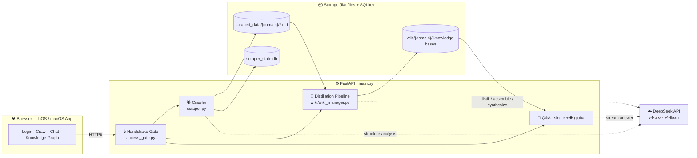
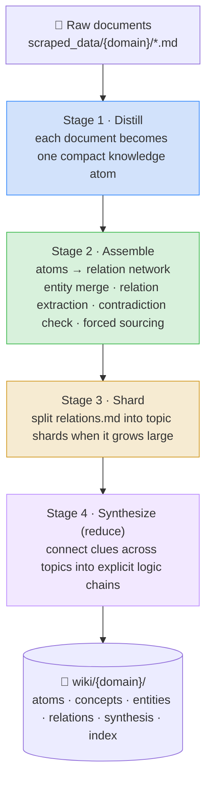
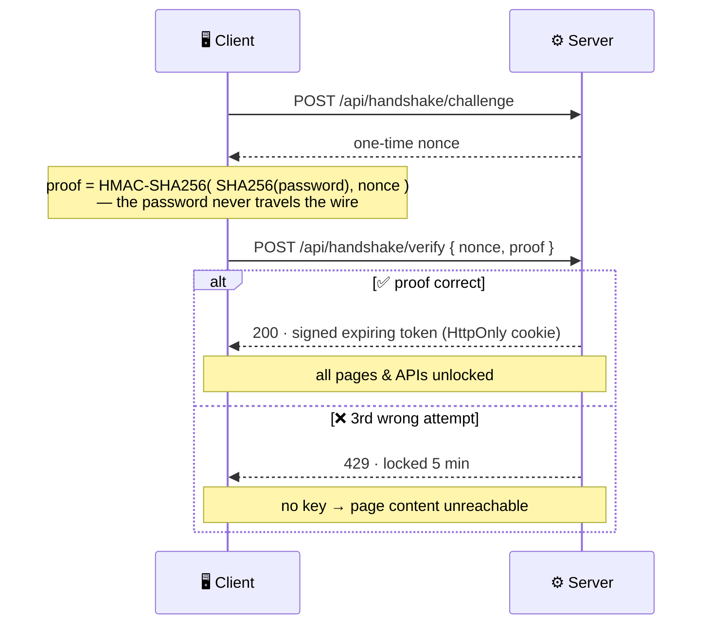
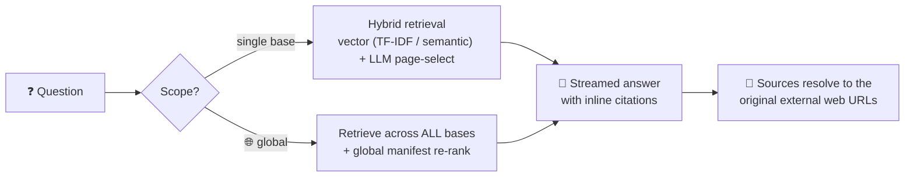

<a id="top"></a>
<div align="center">

# 🦎 Reptile

### 自进化知识库系统 · Self-Weaving Knowledge Base · 自己進化する知識ベース

**Crawl the web → distill it into a compounding knowledge graph → ask it anything in natural language.**
**爬取全网 → 蒸馏为不断复利累积的知识图谱 → 用自然语言追问一切。**
**ウェブを巡回 → 複利的に蓄積する知識グラフへ蒸留 → 自然言語で何でも問い合わせ。**

<br/>


**🌐 Language / 语言 / 言語**  ·  [🇬🇧 English](#english)  ·  [🇨🇳 简体中文](#简体中文)  ·  [🇯🇵 日本語](#日本語)

</div>

---

> **The name is a pun.** In Chinese, **爬虫 (páchóng)** means both *web crawler* and *reptile* 🦎.
> Reptile is a crawler that doesn't just hoard pages — it grows a living, self-organizing brain from them.

---

<a id="visual-overview"></a>

## 🔭 Visual Overview · 架构总览 · 構成概要

### System architecture · 系统架构 · システム構成



### The three-stage distillation pipeline · 三级蒸馏管线 · 三段蒸留パイプライン



### Handshake access protocol · 握手访问协议 · ハンドシェイク認証



### Query flow · 问答流程 · 問い合わせフロー



<div align="center"><sub>

📐 Diagrams render natively on GitHub. · 图示由 GitHub 原生渲染。· 図は GitHub 上でそのまま描画されます。

</sub></div>

---

<a id="english"></a>

## 🇬🇧 English

### What is Reptile?

Reptile is an end-to-end **knowledge-base engine**. Point it at a website; it crawls the content, then uses an LLM (DeepSeek) as a *librarian* — not a search index — to **distill** raw pages into a structured, cross-linked, ever-compounding wiki. You then chat with that knowledge base in natural language and get **sourced, citation-backed answers**, visualized as an interactive knowledge graph.

It is **not RAG**. RAG retrieves raw chunks at query time. Reptile does the hard reasoning *once* at build time — merging entities, extracting relations, detecting contradictions, forging cross-topic logic chains — and stores the result as durable, human-readable knowledge that gets richer with every ingest.

### ✨ Features

| | Feature | What it does |
|---|---|---|
| 🕷️ | **Smart crawler** | Headless Playwright crawl with a DeepSeek-powered, per-domain CSS-selector analysis; full-site / single-page / by-date modes; iterative re-crawl that skips unchanged pages. |
| 🧹 | **Content quality gate** | Drops nav hubs, link lists, login/search/share URLs; prioritizes article pages over index pages; cross-URL content de-duplication. |
| 🧠 | **3-stage distillation** | Documents → knowledge atoms → relation network → topic shards, plus a cross-topic *synthesis* pass that connects clues into new logic chains. |
| 🔗 | **Compounding & traceable** | A persistent entity registry prevents fragmentation as the corpus grows; every fact keeps a `(source: …)` pointer; shrinking pages are auto-backed-up (never lose knowledge). |
| 💬 | **Sourced Q&A** | Streamed answers with clickable `[[page]]` citations; **deep mode** escalates to the reasoning model for query-time synthesis. |
| 🌐 | **Global knowledge base** | Ask across **all** knowledge bases at once, coordinated by an auditable global manifest — every claim labelled with its source base. |
| 🔒 | **Handshake access gate** | Challenge/response HMAC handshake for network deployments; 3 wrong passwords = 5-minute lockout, no access key, no page content. |
| 🗺️ | **Live knowledge graph** | D3 force-directed graph (Obsidian-style) that lights up in real time as the KB builds; drag, zoom, tune forces. |
| 📥 | **Import without crawling** | Build a base from pasted text or uploaded **Word / PDF / Markdown / TXT** with a server-side conversion preview. |
| 🔎 | **Hybrid retrieval** | Zero-config TF-IDF/cosine by default; opt-in neural **semantic embeddings** (any OpenAI-compatible endpoint) with on-disk caching. |
| 📱 | **Native ports** | A SwiftUI iOS/macOS app mirrors the pipeline; a Remotion project renders the brand video. |

### 🏗️ How it works

See the [Visual Overview](#visual-overview) for the diagrams. In short:

1. **Crawl** → `scraper.py` fetches pages with Playwright, extracts the main body (trafilatura / readability / selectors), and saves flat markdown with YAML frontmatter (`source_url`, `title`, date) under `scraped_data/{domain}/`.
2. **Distill** → `wiki/wiki_manager.py` runs the four-stage map-reduce pipeline. Every stage is **resumable** (`.stage1_done` / `.stage2_done` / `.ingested`) so a re-ingest never redoes finished work.
3. **Ask** → `wiki/` answers from the *curated* pages (not raw chunks): a cheap model selects relevant pages, the answer model composes a sourced reply, and `🌐 global` mode spans every base via `wiki/global_manager.py`.

**Hybrid model strategy** (`wiki/deepseek_client.py`): construction uses **`deepseek-v4-pro`** (errors there compound permanently), while routine Q&A uses the faster, cheaper **`deepseek-v4-flash`** — with `deep=True` escalating just the answer step back to the pro tier for genuine clue-connecting.

### 🔒 Network access & the handshake protocol

When you expose Reptile beyond localhost, set one environment variable to lock it down:

```bash
REPTILE_ACCESS_PASSWORD="your-access-password" python main.py
```

- The login page adds an **Access Password** field. The client proves knowledge of the password via a **challenge/response HMAC-SHA256 handshake** — the password itself is never sent over the network.
- Success mints a **signed, expiring access token** (the "key"), stored in an HttpOnly cookie. Middleware then gates every page (→ redirect to login) and API (→ `401`).
- **Three wrong passwords lock the client out for 5 minutes** — during lockout even the correct password yields no key, so no page content is reachable.
- Works even on **plain-HTTP LAN** (where `crypto.subtle` is unavailable) thanks to a built-in pure-JS SHA-256/HMAC fallback. Unset the variable and behaviour is exactly as before (local mode).

### 🌐 Global knowledge base

Pick **🌐 全局知识库 (Global)** in the chat selector to query across every base at once. A derived, auditable manifest (`wiki/_global/manifest.json`) coordinates the bases; each one is vector-searched independently, results are globally re-ranked, and the single answer labels every fact with its source base via `[[base::page]]` citations — so global data stays *traceable*.

### 🚀 Quick start

```bash
# 1. Install dependencies (Playwright browser auto-installs on first run)
pip install -r requirements.txt

# 2. Run the server
python main.py
#   → http://localhost:8000   (binds 0.0.0.0:8000)

# 3. Open the browser, paste your DeepSeek API key, and start crawling.
```

Optional — **end-to-end evaluation** (crawl → build → Q&A accuracy):

```bash
python eval_system.py --api-key YOUR_DEEPSEEK_KEY --url https://www.example.gov/news/
```

### ⚙️ Configuration

| Environment variable | Purpose |
|---|---|
| `DEEPSEEK_API_KEY` | Fallback DeepSeek key (normally supplied per-session at login). |
| `REPTILE_ACCESS_PASSWORD` | Enable the handshake access gate (network protection). Unset = open local mode. |
| `WIKI_EMBED_BASE_URL` · `WIKI_EMBED_API_KEY` · `WIKI_EMBED_MODEL` | Opt-in neural semantic retrieval (any OpenAI-compatible `/embeddings` endpoint). All three required; otherwise TF-IDF is used. |

### 📁 Project structure

```text
Reptile/
├── main.py              # FastAPI app: routes, handshake middleware, SSE
├── access_gate.py       # Challenge/response handshake auth (stdlib only)
├── scraper.py           # Playwright crawler + content extraction
├── content_filter.py    # URL/quality heuristics (skip · prioritize · gate)
├── site_analyzer.py     # DeepSeek per-domain CSS-selector analysis (cached)
├── doc_extract.py       # Word / PDF / Markdown / TXT → markdown
├── db_manager.py        # SQLite task/URL state
├── eval_system.py       # End-to-end evaluation harness
├── wiki/
│   ├── wiki_manager.py     # The 3-stage distillation pipeline
│   ├── global_manager.py   # Cross-base global knowledge base
│   ├── schema.py           # All LLM prompts (the "schema")
│   ├── retrieval.py        # TF-IDF / cosine vector index
│   ├── embeddings.py       # Optional semantic embeddings backend
│   └── deepseek_client.py  # DeepSeek API client (streaming)
├── static/              # Login (handshake) · main app · graph UI
├── app/Reptile.swiftpm/ # SwiftUI iOS/macOS port
└── remotion/            # Brand-video renderer
```

### 🛠️ Tech stack

**Backend** FastAPI · Uvicorn · Playwright (+stealth) · BeautifulSoup4 · trafilatura · readability-lxml · html2text · pdfplumber · python-docx · httpx · SQLite
**Frontend** Vanilla JS · D3.js (force graph) · SSE streaming
**AI** DeepSeek `v4-pro` / `v4-flash` · optional OpenAI-compatible embeddings
**Other** SwiftUI (native app) · Remotion (video) · PyInstaller (`build.py` → standalone `.exe`)

---

<a id="简体中文"></a>

## 🇨🇳 简体中文

### Reptile 是什么？

Reptile 是一个端到端的**知识库引擎**。给它一个网站，它会爬取内容，然后把大模型（DeepSeek）当作**图书馆员**（而非搜索索引），把原始网页**蒸馏**成结构化、相互链接、不断复利累积的知识库。随后你用自然语言与它对话，得到**有据可查、带引用**的回答，并以交互式知识图谱可视化呈现。

它**不是 RAG**。RAG 在查询时检索原始片段；Reptile 在构建时一次性完成最难的推理——实体归并、关系提取、矛盾检测、跨主题逻辑链贯通——并把结果沉淀为持久、可读、越用越丰富的知识。

### ✨ 功能特色

| | 功能 | 说明 |
|---|---|---|
| 🕷️ | **智能爬虫** | Playwright 无头爬取，DeepSeek 按域名分析 CSS 选择器；全站 / 单页 / 按日期三种模式；迭代更新自动跳过未变化页面。 |
| 🧹 | **内容质量门** | 过滤导航页、链接列表、登录/搜索/分享类 URL；文章页优先于索引页；跨 URL 内容去重。 |
| 🧠 | **三级蒸馏** | 文档 → 知识原子 → 关系网 → 主题分片，并有跨主题**贯通**环节，把线索串成新逻辑链路。 |
| 🔗 | **复利累积 · 可溯源** | 持久实体注册表防止知识库增长时碎片化；每条事实保留 `（来源: …）`；页面骤缩自动备份，绝不丢失知识。 |
| 💬 | **有据问答** | 流式回答，`[[页面]]` 引用可点击；**深度模式**升级到推理模型做查询时贯通。 |
| 🌐 | **全局知识库** | 一次性跨**所有**知识库提问，由可审计的全局清单协调，每条信息标注来源库。 |
| 🔒 | **握手访问网关** | 面向网络部署的质询/应答 HMAC 握手；连续 3 次错误即锁定 5 分钟，拿不到密钥就看不到任何页面内容。 |
| 🗺️ | **实时知识图谱** | D3 力导向图（Obsidian 风格），建库时实时点亮；可拖拽、缩放、调节力场。 |
| 📥 | **免爬取导入** | 粘贴文本或上传 **Word / PDF / Markdown / TXT** 建库，建库前可服务端预览解析效果。 |
| 🔎 | **混合检索** | 默认零配置 TF-IDF/余弦；可选神经**语义向量**（任意 OpenAI 兼容接口），向量本地缓存。 |
| 📱 | **原生移植** | SwiftUI iOS/macOS 应用等价移植管线；Remotion 工程渲染品牌视频。 |

### 🏗️ 工作原理

图示见 [架构总览](#visual-overview)。简而言之：

1. **爬取** → `scraper.py` 用 Playwright 抓取页面，提取正文（trafilatura / readability / 选择器），保存为带 YAML frontmatter（`source_url`、`title`、日期）的扁平 Markdown，存于 `scraped_data/{域}/`。
2. **蒸馏** → `wiki/wiki_manager.py` 运行四阶段 map-reduce 管线。每个阶段都**可断点续传**（`.stage1_done` / `.stage2_done` / `.ingested`），重复建库绝不重做已完成的工作。
3. **问答** → 从**策展页面**（而非原始片段）作答：先用便宜模型选页，再用回答模型组织带引用的答复；`🌐 全局`模式经 `wiki/global_manager.py` 跨所有库。

**混合模型策略**（`wiki/deepseek_client.py`）：构建用 **`deepseek-v4-pro`**（此处出错会永久放大），日常问答用更快更省的 **`deepseek-v4-flash`**——`deep=True` 时仅把回答步骤升级回 pro 档做真正的线索贯通。

### 🔒 网络访问与握手协议

当把 Reptile 暴露到本机之外时，设一个环境变量即可加锁：

```bash
REPTILE_ACCESS_PASSWORD="你的访问密码" python main.py
```

- 登录页会出现**访问密码**栏。客户端通过**质询/应答 HMAC-SHA256 握手**证明自己知道密码——**密码本身从不在网络上传输**。
- 验证通过即下发**带签名、会过期的访问令牌**（"密钥"），存于 HttpOnly Cookie。中间件随后拦截所有页面（→跳登录）与接口（→`401`）。
- **连续 3 次输错即锁定 5 分钟**——锁定期内即便密码正确也拿不到密钥，任何页面内容都无法访问。
- 即便在**纯 HTTP 局域网**（`crypto.subtle` 不可用）下也能工作，因内置纯 JS 的 SHA-256/HMAC 兜底。不设该变量则行为与本地模式完全一致。

### 🌐 全局知识库

在问答的知识库选择器里选 **🌐 全局知识库（跨所有库）**，即可一次性跨所有库提问。派生且可审计的清单（`wiki/_global/manifest.json`）协调各库；各库分别向量检索，结果全局重排，最终一条答复用 `[[库名::页面]]` 标注每条事实的来源库——做到全局数据**有据可查**。

### 🚀 快速开始

```bash
# 1. 安装依赖（首次运行会自动安装 Playwright 浏览器）
pip install -r requirements.txt

# 2. 启动服务
python main.py
#   → http://localhost:8000   （监听 0.0.0.0:8000）

# 3. 打开浏览器，粘贴你的 DeepSeek API Key，开始爬取。
```

可选——**端到端评测**（爬取 → 建库 → 问答准确率）：

```bash
python eval_system.py --api-key 你的DeepSeek密钥 --url https://www.example.gov/news/
```

### ⚙️ 配置项

| 环境变量 | 用途 |
|---|---|
| `DEEPSEEK_API_KEY` | DeepSeek 兜底密钥（通常在登录时按会话提供）。 |
| `REPTILE_ACCESS_PASSWORD` | 启用握手访问网关（网络保护）。不设 = 开放的本地模式。 |
| `WIKI_EMBED_BASE_URL` · `WIKI_EMBED_API_KEY` · `WIKI_EMBED_MODEL` | 可选神经语义检索（任意 OpenAI 兼容 `/embeddings` 接口）。三者需同时设置，否则回退 TF-IDF。 |

### 📁 项目结构

```text
Reptile/
├── main.py              # FastAPI 应用：路由、握手中间件、SSE
├── access_gate.py       # 质询/应答握手鉴权（仅标准库）
├── scraper.py           # Playwright 爬虫 + 正文抽取
├── content_filter.py    # URL/质量启发式（跳过·优先级·门控）
├── site_analyzer.py     # DeepSeek 按域名分析 CSS 选择器（缓存）
├── doc_extract.py       # Word / PDF / Markdown / TXT → markdown
├── db_manager.py        # SQLite 任务/URL 状态
├── eval_system.py       # 端到端评测脚本
├── wiki/
│   ├── wiki_manager.py     # 三级蒸馏管线
│   ├── global_manager.py   # 跨库的全局知识库
│   ├── schema.py           # 全部大模型 Prompt（"schema"）
│   ├── retrieval.py        # TF-IDF / 余弦 向量索引
│   ├── embeddings.py       # 可选语义向量后端
│   └── deepseek_client.py  # DeepSeek API 客户端（流式）
├── static/              # 登录（握手）· 主应用 · 图谱 UI
├── app/Reptile.swiftpm/ # SwiftUI iOS/macOS 移植
└── remotion/            # 品牌视频渲染
```

### 🛠️ 技术栈

**后端** FastAPI · Uvicorn · Playwright（+stealth）· BeautifulSoup4 · trafilatura · readability-lxml · html2text · pdfplumber · python-docx · httpx · SQLite
**前端** 原生 JS · D3.js（力导向图）· SSE 流式
**AI** DeepSeek `v4-pro` / `v4-flash` · 可选 OpenAI 兼容向量
**其他** SwiftUI（原生应用）· Remotion（视频）· PyInstaller（`build.py` → 独立 `.exe`）

---

<a id="日本語"></a>

## 🇯🇵 日本語

### Reptile とは？

Reptile はエンドツーエンドの**ナレッジベース・エンジン**です。ウェブサイトを指定すると内容を巡回し、LLM（DeepSeek）を*検索インデックスではなく司書*として使い、生のページを構造化され相互リンクされ複利的に蓄積するウィキへ**蒸留**します。あとは自然言語で対話すれば、**出典付き・引用付き**の回答が得られ、インタラクティブな知識グラフとして可視化されます。

これは**RAG ではありません**。RAG はクエリ時に生のチャンクを取得しますが、Reptile は最も難しい推論——エンティティ統合、関係抽出、矛盾検出、トピック横断の論理連鎖——を構築時に*一度だけ*行い、その結果を永続的で人間可読、使うほど豊かになる知識として保存します。

### ✨ 特徴

| | 機能 | 内容 |
|---|---|---|
| 🕷️ | **スマートクローラー** | Playwright ヘッドレス巡回、DeepSeek によるドメイン別 CSS セレクタ解析；全サイト / 単一ページ / 日付指定の3モード；変更のないページをスキップする反復更新。 |
| 🧹 | **コンテンツ品質ゲート** | ナビ・リンク集・ログイン/検索/共有 URL を除外；記事ページを索引ページより優先；URL 横断の重複除去。 |
| 🧠 | **三段蒸留** | 文書 → 知識アトム → 関係ネットワーク → トピック分割、さらにトピック横断の**統合**で手がかりを新しい論理連鎖に結ぶ。 |
| 🔗 | **複利的・追跡可能** | 永続エンティティ登録簿が成長時の断片化を防止；各事実に `（出典: …）` を保持；縮小したページは自動バックアップ（知識を失わない）。 |
| 💬 | **出典付き Q&A** | ストリーミング回答、クリック可能な `[[ページ]]` 引用；**ディープモード**は推論モデルに昇格しクエリ時統合。 |
| 🌐 | **グローバル・ナレッジベース** | **すべて**のナレッジベースを一度に横断質問。監査可能なグローバル目録が調整し、各情報に出典ベースを明示。 |
| 🔒 | **ハンドシェイク認証ゲート** | ネットワーク公開向けのチャレンジ/レスポンス HMAC ハンドシェイク；パスワード3回ミスで5分ロック、鍵が得られなければページ内容も不可視。 |
| 🗺️ | **リアルタイム知識グラフ** | D3 力学グラフ（Obsidian 風）。構築中にリアルタイムで点灯し、ドラッグ・ズーム・力場調整が可能。 |
| 📥 | **巡回なしインポート** | テキスト貼り付けや **Word / PDF / Markdown / TXT** アップロードで構築。構築前にサーバ側で変換プレビュー。 |
| 🔎 | **ハイブリッド検索** | 既定はゼロ設定の TF-IDF/コサイン；任意で OpenAI 互換の**意味ベクトル**（ディスクキャッシュ付き）。 |
| 📱 | **ネイティブ移植** | SwiftUI iOS/macOS アプリがパイプラインを等価移植；Remotion でブランド動画を描画。 |

### 🏗️ 仕組み

図は [構成概要](#visual-overview) を参照。要約すると：

1. **巡回** → `scraper.py` が Playwright でページを取得し本文を抽出（trafilatura / readability / セレクタ）、YAML フロントマター（`source_url`・`title`・日付）付きのフラットな Markdown を `scraped_data/{ドメイン}/` に保存。
2. **蒸留** → `wiki/wiki_manager.py` が4段階の map-reduce パイプラインを実行。各段階は**再開可能**（`.stage1_done` / `.stage2_done` / `.ingested`）で、再取り込みでも完了済みの作業をやり直しません。
3. **質問** → 生チャンクではなく*厳選ページ*から回答：軽量モデルがページを選定し、回答モデルが出典付きで構成。`🌐 グローバル`モードは `wiki/global_manager.py` で全ベースを横断。

**ハイブリッド・モデル戦略**（`wiki/deepseek_client.py`）：構築には **`deepseek-v4-pro`**（ここでの誤りは永続的に増幅）、日常 Q&A には高速・低コストの **`deepseek-v4-flash`**。`deep=True` の時のみ回答ステップを pro 段に戻し、真の手がかり結合を行います。

### 🔒 ネットワークアクセスとハンドシェイク

Reptile を localhost の外に公開する場合、環境変数を一つ設定するだけでロックできます：

```bash
REPTILE_ACCESS_PASSWORD="あなたのアクセスパスワード" python main.py
```

- ログイン画面に**アクセスパスワード**欄が追加されます。クライアントは**チャレンジ/レスポンス HMAC-SHA256 ハンドシェイク**でパスワードの知識を証明します——**パスワード自体はネットワークに流れません**。
- 成功すると**署名付き・有効期限付きのアクセストークン**（"鍵"）が HttpOnly Cookie に発行されます。以降ミドルウェアが全ページ（→ログインへリダイレクト）と API（→`401`）をゲートします。
- **パスワード3回ミスで5分ロック**——ロック中は正しいパスワードでも鍵が得られず、ページ内容に一切到達できません。
- 純 JS の SHA-256/HMAC フォールバックを内蔵するため、**平文 HTTP の LAN**（`crypto.subtle` 不可）でも動作します。変数を未設定にすればローカルモードで従来どおりです。

### 🌐 グローバル・ナレッジベース

チャットのセレクタで **🌐 全局知識库（全ベース横断）** を選ぶと、すべてのベースを一度に横断質問できます。派生かつ監査可能な目録（`wiki/_global/manifest.json`）が各ベースを調整。各ベースを個別にベクトル検索し、結果をグローバルに再ランクし、最終回答は `[[ベース::ページ]]` 引用で各事実の出典ベースを明示——グローバルデータは**追跡可能**なままです。

### 🚀 クイックスタート

```bash
# 1. 依存関係をインストール（初回実行時に Playwright ブラウザが自動導入）
pip install -r requirements.txt

# 2. サーバを起動
python main.py
#   → http://localhost:8000   （0.0.0.0:8000 で待受）

# 3. ブラウザを開き、DeepSeek API キーを貼り付けて巡回を開始。
```

任意——**エンドツーエンド評価**（巡回 → 構築 → Q&A 精度）：

```bash
python eval_system.py --api-key あなたのDeepSeekキー --url https://www.example.gov/news/
```

### ⚙️ 設定

| 環境変数 | 用途 |
|---|---|
| `DEEPSEEK_API_KEY` | DeepSeek のフォールバックキー（通常はログイン時にセッション単位で指定）。 |
| `REPTILE_ACCESS_PASSWORD` | ハンドシェイク認証ゲートを有効化（ネットワーク保護）。未設定 = オープンなローカルモード。 |
| `WIKI_EMBED_BASE_URL` · `WIKI_EMBED_API_KEY` · `WIKI_EMBED_MODEL` | 任意の意味ベクトル検索（OpenAI 互換 `/embeddings`）。3つすべて必要、未設定なら TF-IDF。 |

### 📁 プロジェクト構成

```text
Reptile/
├── main.py              # FastAPI アプリ：ルート、ハンドシェイク・ミドルウェア、SSE
├── access_gate.py       # チャレンジ/レスポンス認証（標準ライブラリのみ）
├── scraper.py           # Playwright クローラー + 本文抽出
├── content_filter.py    # URL/品質ヒューリスティック（スキップ・優先・ゲート）
├── site_analyzer.py     # DeepSeek ドメイン別 CSS セレクタ解析（キャッシュ）
├── doc_extract.py       # Word / PDF / Markdown / TXT → markdown
├── db_manager.py        # SQLite タスク/URL 状態
├── eval_system.py       # エンドツーエンド評価スクリプト
├── wiki/
│   ├── wiki_manager.py     # 三段蒸留パイプライン
│   ├── global_manager.py   # ベース横断のグローバル KB
│   ├── schema.py           # すべての LLM プロンプト（"schema"）
│   ├── retrieval.py        # TF-IDF / コサイン ベクトル索引
│   ├── embeddings.py       # 任意の意味ベクトル・バックエンド
│   └── deepseek_client.py  # DeepSeek API クライアント（ストリーミング）
├── static/              # ログイン（ハンドシェイク）· 本体 · グラフ UI
├── app/Reptile.swiftpm/ # SwiftUI iOS/macOS 移植
└── remotion/            # ブランド動画レンダラー
```

### 🛠️ 技術スタック

**バックエンド** FastAPI · Uvicorn · Playwright（+stealth）· BeautifulSoup4 · trafilatura · readability-lxml · html2text · pdfplumber · python-docx · httpx · SQLite
**フロントエンド** バニラ JS · D3.js（力学グラフ）· SSE ストリーミング
**AI** DeepSeek `v4-pro` / `v4-flash` · 任意の OpenAI 互換ベクトル
**その他** SwiftUI（ネイティブアプリ）· Remotion（動画）· PyInstaller（`build.py` → 単体 `.exe`）

---

<div align="center">

🦎 **Reptile** — crawl · distill · compound · ask
爬取 · 蒸馏 · 复利 · 追问  ·  巡回 · 蒸留 · 蓄積 · 問い合わせ

<sub>Powered by DeepSeek · Built with FastAPI + Playwright + D3</sub>

[⬆ Back to top / 返回顶部 / トップへ](#top)

</div>
